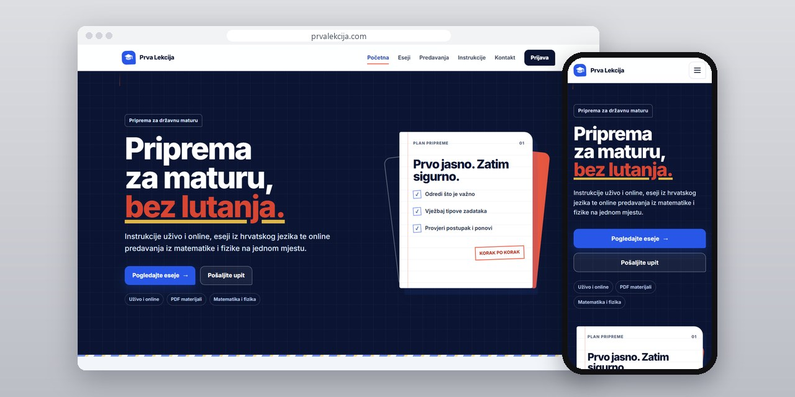
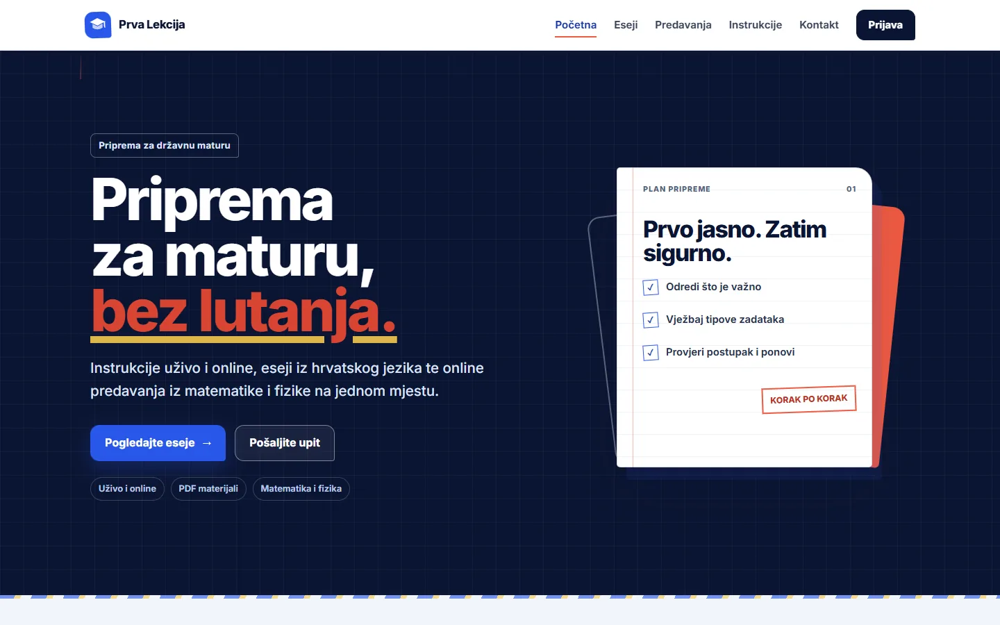
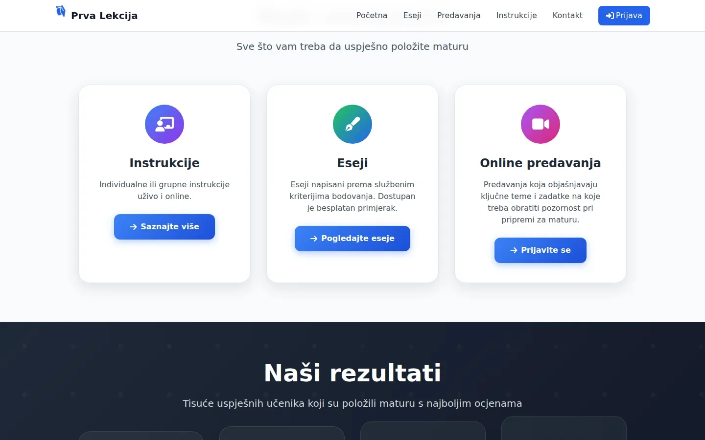
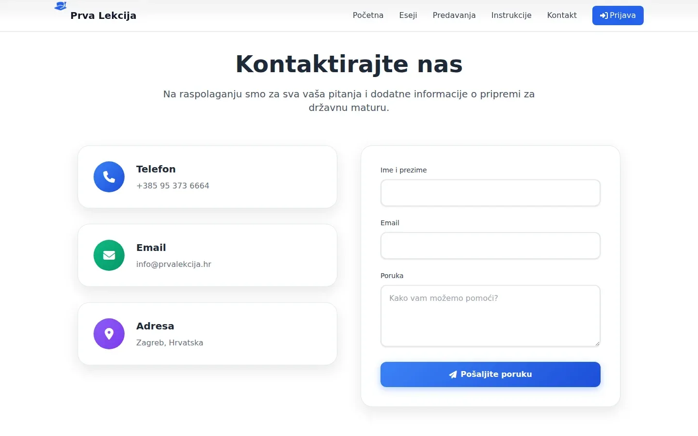

# Prva Lekcija

Site for Croatian state matura prep in Zagreb, with student accounts and study material delivered only after Stripe confirms the payment.

**[prvalekcija.com](https://prvalekcija.com/)** · [Case study (in Serbian)](https://svilenkovic.com/radovi/prva-lekcija) · [Srpski](README.sr.md)

> [!NOTE]
> Client project. The source code belongs to the client and stays in a private repository. This page describes what I built and how.

<table>
  <tr><td><b>Client</b></td><td>Prva Lekcija</td></tr>
  <tr><td><b>Industry</b></td><td>Croatian state matura prep: tutoring, essays and online lectures</td></tr>
  <tr><td><b>Location</b></td><td>Zagreb, Croatia</td></tr>
  <tr><td><b>Type</b></td><td>Website with accounts and online payments</td></tr>
  <tr><td><b>My role</b></td><td>Design, development, payments, SEO, hosting and maintenance</td></tr>
  <tr><td><b>Stack</b></td><td>PHP 8.3, MariaDB, Stripe Checkout, nginx, Tailwind</td></tr>
</table>

## About the project

Prva Lekcija prepares students in Zagreb for the Croatian state matura: tutoring, essays written to the official scoring criteria and online lectures in maths and physics. The site is in Croatian and had to sell digital material. A student pays by card and gets the file straight away, and it stays in their account for later, on any device, or arrives by email when they buy without one.

In the payment flow the browser decides nothing. Only a product ID leaves the page; the server writes a pending purchase before opening Stripe Checkout, and a single function moves it to completed with a conditional update. The return page and the Stripe webhook both call that function, so the material is delivered exactly once. Neither of them trusts the request: the return page asks Stripe about the session again and the webhook needs a valid signature.

## What I built

- Registration, login and an account page with past purchases, plus login rate limiting, a new session ID after login and CSRF tokens on every change
- A small Stripe client on cURL with a pinned API version instead of the whole SDK; card details never reach this server
- Stripe's automatic currency conversion switched off after a real checkout showed visitors outside the eurozone a converted amount at a worse rate than the site's price
- The contact form used to show a success message without sending anything; now it validates on the server, has a honeypot and a per-IP limit, and saves each message before trying email
- Page cache in nginx for anonymous visitors; the session resumes only if its cookie already exists, so a casual visit never gets a session cookie that bypasses the cache
- An admin panel for users, products, purchases and messages, with an audit log and a rule that stops an admin from deleting or demoting themselves

## Results

| | Performance | Accessibility | Best practices | SEO |
| :-- | :-: | :-: | :-: | :-: |
| Mobile | 100 | 100 | 100 | 100 |
| Desktop | 100 | 100 | 100 | 100 |

PageSpeed Insights, lab test of the live site, September 2026. Security headers: 6 of 6. HTML validator: no errors. axe accessibility check: no violations. Structured data: `EducationalOrganization`.

## Screenshots

<table>
  <tr>
    <td width="68%" valign="top"></td>
    <td width="32%" valign="top"></td>
  </tr>
</table>

Materials: tutoring, essays and online lectures, each with its own page

Contact: a form that saves the inquiry to the database first, and only then tries to send an email

---

Built by [D. Svilenković](https://svilenkovic.com).
